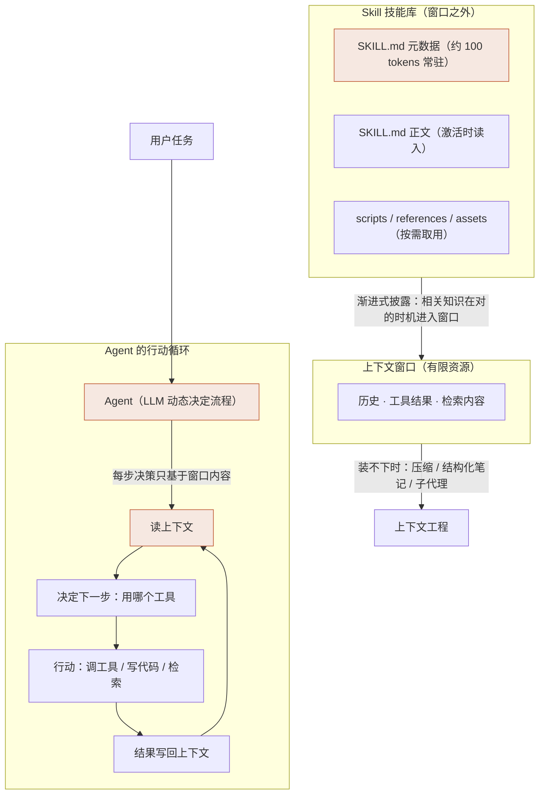

# 三个概念的关系：上下文 · Agent · Skill

> 配套的图文版见同目录 [concept-relationship.html](concept-relationship.html)。本页用 Mermaid 图在 GitHub 上原生渲染。

## 一、关系总览

## 二、一张表分清

| | 是什么 | 解决什么问题 | 形态 |
|------|--------|--------------|------|
| **上下文** | 模型每次采样看到的全部 token | 决策的"依据"，但是有限资源且有 context rot | 一个窗口（系统提示 + 历史 + 检索…） |
| **Agent** | LLM 动态决定流程与工具使用的系统 | 开放式的、步骤无法预知的任务 | LLM + 规划/记忆/工具 的行动循环 |
| **Skill** | 含 SKILL.md 的文件夹，程序性知识包 | 同一本事不用每次现教，跨产品可移植 | 目录（元数据 → 正文 → 资源 三层按需加载） |

## 三、关键关系

### ① 上下文如何影响 Agent 的工作

Agent 的每一步决策**只能基于窗口里的内容**——看不见的就等于不存在。所以上下文质量直接决定 Agent 每一步的决策质量：塞太少，它缺信息瞎猜；塞太多，context rot（token 越多召回越不准）让它看不清重点。原文给的答案是把它当**有限资源**经营，追求"最小的高信号 token 集"（smallest possible set of high-signal tokens）；装不下时用压缩（compaction）、结构化笔记（agentic memory）、子代理（sub-agent architectures）三种手段腾地方。

### ② Skill 如何沉淀可复用的任务知识

老师傅的经验如果每次都口头教，既贵又不稳定。Skill 把"怎么做这类任务"写成**文件夹**（SKILL.md + 脚本 + 参考文档），通过渐进式披露三层机制——启动时只占约 100 tokens 的元数据，激活才读正文，资源按需取用——让知识**常驻库存、按需上台**，可捆绑的内容量接近无上限（effectively unbounded）。

### ③ 三者合起来：一个自洽的分工

**上下文**是有限的工作台，**Agent** 是在工作台上做决策的循环，**Skill** 是让对的知识在对的时机登上工作台的机制。没有 Skill，Agent 每次都现学、上下文被教程塞爆；没有上下文工程，Skill 注入得再好也会被垃圾信息淹没——三者缺一，系统都跑不利索。

## 参考来源（可点击验证）

- Anthropic《Building effective agents》（2024-12）：<https://www.anthropic.com/engineering/building-effective-agents>
- Anthropic《Effective context engineering for AI agents》（2025-09）：<https://www.anthropic.com/engineering/effective-context-engineering-for-ai-agents>
- Anthropic《Equipping agents for the real world with Agent Skills》（2025-10）：<https://www.anthropic.com/engineering/equipping-agents-for-the-real-world-with-agent-skills>
- Lilian Weng《LLM Powered Autonomous Agents》（2023-06）：<https://lilianweng.github.io/posts/2023-06-23-agent/>
- Agent Skills 开放规范：<https://agentskills.io/specification>
